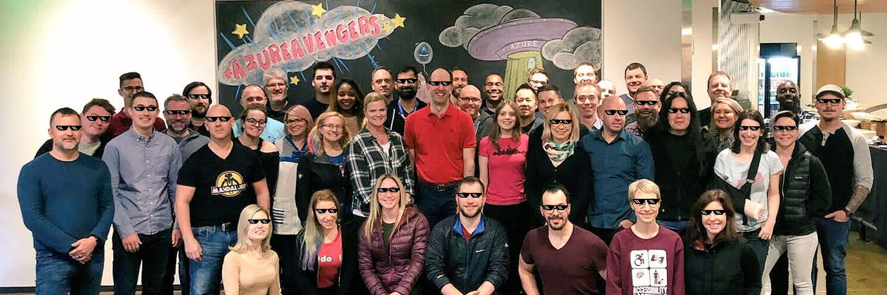

# Deal With It

Using the [Free Azure Face API](https://aka.ms/AA2w4ji), JavaScript and the Jimp image manipulation library I’ll show you how you can add deal-with-it shades to every face in an image.

We'll use the Face API to figure all the locations of all the faces in the image and then we’ll use Jimp to layer glasses on each face and generate the output jpeg.



# Setup & Run

Install all packages

```bash
npm install
```

Run TypeScript compiler

```bash
npm run build
```

Try it out with an image

```bash
node deal.js [ONLINE-URL-TO-AN-IMAGE-WITH-A-FACE]
```

It will output a file to `./out/thuged.jpg` with deal with it glasses added to each face.
